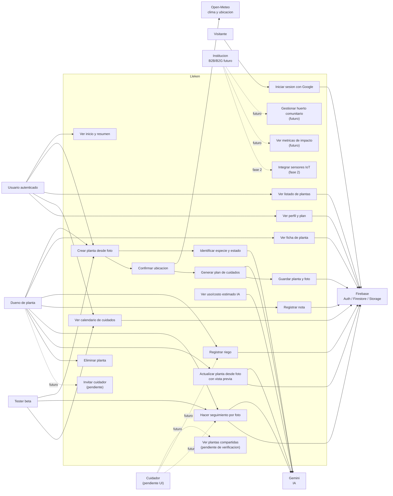

# Diagrama de casos de uso - estado actual

Fecha: 2026-05-01

Objetivo: mostrar quien interactua con Lleken y que casos de uso existen hoy, separando lo funcional de lo preparado pero no terminado.

## Lectura rapida

Actores principales:

- Visitante: persona sin sesion iniciada.
- Usuario autenticado: persona que entra con Google.
- Dueno de planta: usuario que crea una planta.
- Cuidador: rol preparado en datos, pendiente de UI completa.
- Tester beta: persona del grupo pequeno de validacion.
- Institucion: municipalidad, ONG, colegio o empresa RSE que puede financiar/gestionar huertos.
- Servicios externos: Gemini, Open-Meteo y Firebase.

## Diagrama

## Casos de uso actuales

| Actor | Caso de uso | Estado |
|---|---|---|
| Visitante | Iniciar sesion con Google | funcional |
| Usuario autenticado | Ver inicio, listado, calendario y perfil | funcional |
| Dueno | Crear planta desde foto | funcional |
| Dueno | Confirmar ubicacion con sugerencias/geolocalizacion | funcional |
| Dueno | Generar plan con clima real o fallback controlado | funcional |
| Dueno | Guardar foto en Storage y datos en Firestore | funcional |
| Dueno | Ver ficha de planta | funcional |
| Dueno | Registrar riego y notas | funcional |
| Dueno | Hacer seguimiento por foto | funcional |
| Dueno | Actualizar planta desde foto con vista previa | funcional |
| Dueno | Eliminar planta | funcional, debe revisarse con reglas |
| Usuario autenticado | Ver uso/costo estimado de Gemini | tecnico, no necesariamente UI final |
| Cuidador | Ver y cuidar planta compartida | pendiente |
| Dueno | Invitar cuidador | pendiente |
| Tester beta | Probar flujo completo y reportar fricciones | objetivo del mes |
| Institucion | Gestionar o financiar huertos comunitarios | futuro |
| Institucion | Ver metricas de impacto ambiental/social | futuro |
| Equipo / piloto PAC | Validar uso real en huerto comunitario | objetivo de validacion |

## Notas de alcance

- El rol cuidador existe como intencion en campos `caregiverIds` y `memberIds`, pero aun no debe presentarse como feature terminada.
- El prototipo beta debe enfocarse primero en el flujo individual de planta, calendario y seguimiento, sin perder de vista que PAC valida el caso comunitario.
- Cuidadores es el siguiente gran bloque funcional, pero no conviene mezclarlo con diagramas del estado actual sin marcarlo como pendiente.
- Instituciones, metricas B2B/B2G y sensores IoT son parte de la vision/negocio, no del prototipo actual.
